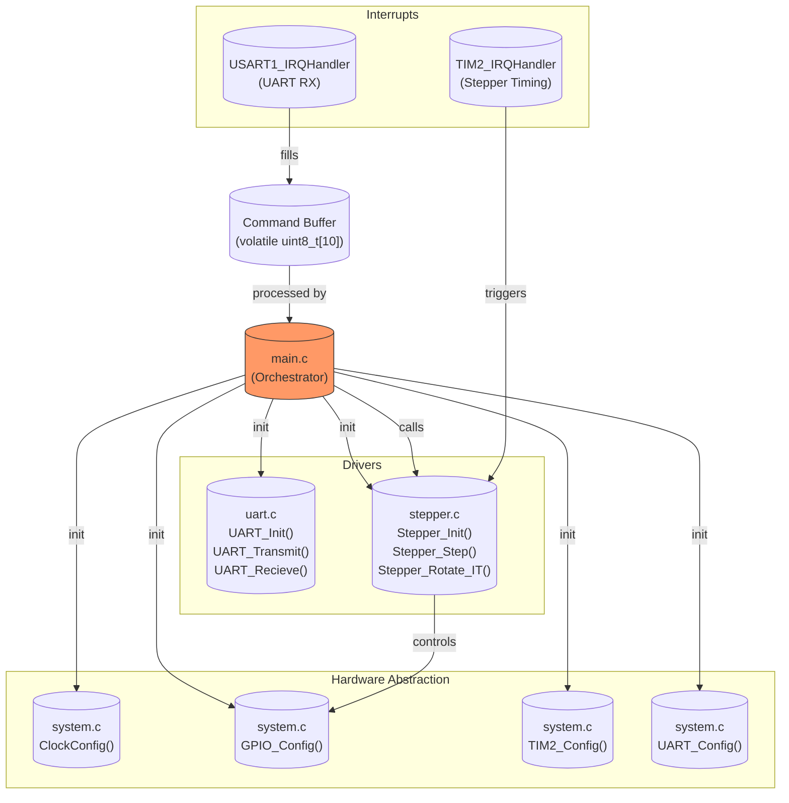

# Драйвер шаговика

Это прошивка для простого драйвера шагового двигателя, управляемого по UART. 

## TODO

## Структура проекта

1. driver/timer.h - низкоуровневое управление таймерами, в основной ветке не используется.
2. driver/stepper.h - низкоуровневое управление шаговым двигателем, тип дескриптора шаговика, функции обратного вызова.
3. driver/uart.h - низкоуровневое управление UART, тип дескриптора UART, функции обратного вызова.
4. driver/interrupts.h - обработчики прерываний.
5. core/system.h - низкоуровневая инициализация системы, общие константы.
6. core/types.h - тип(ы), которые нужны всем модулям, например системный контекст.
7. utils/service.c - вспомогательные функции, например простая реализация atoi.
8. hardware - схемы отладочной платы.

## Структура system.h

В этом файле находятся функции, конфигурирующие периферию и дерево тактирования, а также несколько вспомогательных функций.

### Дерево тактирования

Используется путь `HSI->/2->PLLx12->AHB/1->APB1/1, APB2/1`, так что `f(SYSCLK)=f(PCLK1)=f(PCLK2)=48MHz`. Во время инициализации один раз выполняются функции `Get_SYSCLKFreq()` и пр., их значения присваиваются глобальным переменным и к ним можно получить через макросы `SYSCLK_FREQ` и пр (см. файл). Это допустимо, так как изменение частоты в рантайме не предусмотрено, а если откажет PLL, то контроллер всё равно не сможет это обнаружить и принять меры.

### TIM2

Для неблокирующего управления двигателем используется TIM2 в базовом режиме, поэтому его инициализация производится здесь. В целом сказать больше нечего.

## Структура uart.h

Файл содержит реализацию драйвера UART, обеспечивающего базовые функции передачи и приема данных с поддержкой прерываний. Основные компоненты:

Структуры данных:

1. `UART_Handle`: Хранит состояние UART (указатель на периферию USART, буфер приема, счетчик оставшихся данных, флаги ошибок и готовности команды).

Инициализация:

1. `UART_Init()`: Инициализирует обработчик UART из глобального пула, настраивает прерывание приема (RXNE). Поддерживает до `MAX_UARTS` экземпляров.

Функции ввода-вывода:

1. `UART_Transmit()`: Блокирующая передача данных с проверкой таймаута. Ожидает флаги TXE (готовность к передаче) и TC (завершение передачи).

2. `UART_Receive()`: Неблокирующий старт приема данных. Устанавливает буфер и размер данных для заполнения через прерывания.

Управление состоянием:

3. Геттеры/сеттеры (`UART_GetCmdRdy`, `UART_SetRxLeft` и др.): Для доступа к флагам готовности команды и счетчику оставшихся данных.

Обработка прерываний:

4. `UART_ReceiveCallback()`: Обрабатывает принятые данные при срабатывании прерывания. Записывает данные в буфер, обновляет курсор и флаг `command_ready` при завершении приема.

## Структура stepper.h

Файл содержит реализацию управления шаговыми двигателями с поддержкой блокирующих и асинхронных операций. Основные компоненты:

Структуры данных:

1. `Stepper_Handle`:

- `gpios`: Указатель на массив GPIO, управляющих катушками двигателя.
- `config`: Массив конфигураций включения катушек для каждого шага (например, для полношагового режима).
- `instance`: Таймер (TIM), используемый для асинхронного управления.
- `config_idx`: Текущий индекс в массиве конфигураций.
- `direc`: Направление вращения.
- `steps_left`: Оставшееся количество шагов (для асинхронного режима).

Инициализация:

1. `Stepper_Init()`:

Инициализирует объект шагового двигателя из глобального пула. Связывает GPIO и конфигурацию катушек, сбрасывает состояние двигателя. Поддерживает до MAX_STEPPERS экземпляров.

Основные функции:

1. `Stepper_Step()`: Выполняет один шаг в заданном направлении. Активирует катушки согласно текущей конфигурации (`config[config_idx]`). Обновляет `config_idx` (инкремент/декремент в зависимости от направления).

2. `Stepper_Halt()`: Останавливает двигатель, отключая катушки (если hold = RESET).

3. `Stepper_Rotate()`: Блокирующий метод вращения на заданное количество шагов. Циклически вызывает `Stepper_Step()` с задержкой del между шагами.

4. `Stepper_Rotate_IT()`: Неблокирующий метод вращения через прерывания таймера.Настраивает таймер TIM2 на генерацию прерываний через интервал `del`. Уменьшает `steps_left` при каждом прерывании.

Обработка прерываний:

1. `TIM_UEV_Callback()`: Вызывается при срабатывании таймера (Update Event):

Выполняет шаг двигателя и уменьшает `steps_left`.
Останавливает таймер при завершении вращения (`steps_left` == 0).

Ограничения:

1. Жесткая привязка к GPIOB (в текущей реализации).
2. Нет проверки ошибок (указано в \todo).

6. Зависимости:

Таймер TIM2 используется для асинхронного управления, конфигурация GPIO должна быть предварительно настроена (направление, режим).

## Переключение катушек с использованием только таймеров

Управлять катушками можно с помощью только таймеров. Сейчас прерывание генерируется в среднем раз в 10 мс, а это довольно часто. Эту проблему можно решить, используя таймеры расширенного управления, а именно регистр `RCR`. Можно генерировать событие обновления не на каждом шаге, а только раз в определённое количество шагов и управлять выводами GPIO с помощью каналов таймера. Тогда прерывание будет генерироваться в худшем случае каждые 256 шагов, то есть в среднем раз в 2.5 с. Однако мне не удалось (пока?) придумать, как создать нужный сигнал с помощью только одного таймера, поэтому можно использовать два. Чтобы генерировать сигналы для полношагового двухфазного режима (самый простой вариант), можно поступить так:
 ```mermaid
 graph TD
    TIM1 --> |CH1| GPIO1
    TIM1 --> |CH2| GPIO2

    TIM1 --> |CH3, TRGO| TIM2
    TIM2 --> |CH1| GPIO3
    TIM2 --> |CH2| GPIO4
```

Каналы 1 и 2 таймера 1 комплементарны, как и каналы 1 и 2 таймера 2. Канал 3 таймера 1 работает в режиме OC Active и создаёт задержку в половину периода для таймера 2, который работает в режиме Trigger. Таким образом создаётся смещение по фазе в 90 градусов между сигналами первого и второго таймера.

Эта идея была отброшена из-за сложности, в данный момент игра не стоит свеч.

## Иерархия проекта в целом

